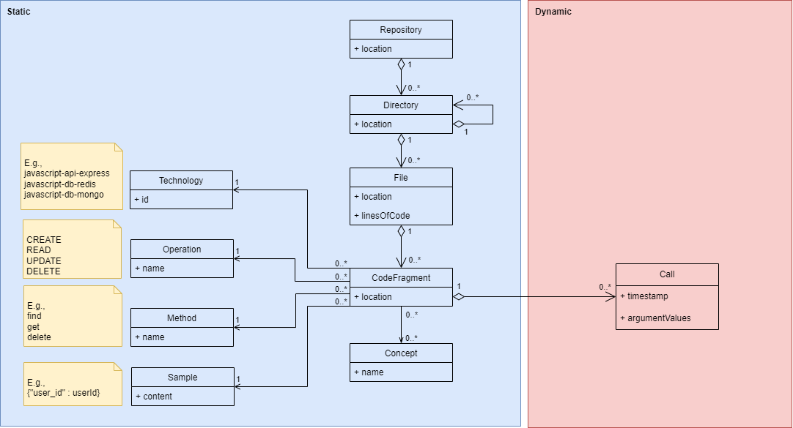

# DENIM Reverse Engineering Dynamic Analysis

## 📣 Description

This module provides a way to capture runtime information about the data accesses previously detected by a static analysis and to add the calls to the [reverse engineering static analysis](https://gitlab.unamur.be/denim/reverse-engineering)' JSON report.

## 📝 How to cite?

```latex

%%% Cite the paper

@inproceedings{deRycke2025,
  title         = {Visualizing Data Access Traces in Microservices Using Animated Heat Treemaps},
  author        = {De Rycke, Maxime and Andr{\'e}, Maxime and Raglianti, Marco and Cleve, Anthony and Lanza, Michele},
  booktitle     = {Proceedings of the 13th Working Conference on Software Visualization (VISSOFT 2025): NIER Track},
  year          = {2025},
  organization  = {IEEE Computer Society Press},
  doi           = {https://doi.org/10.1109/vissoft67405.2025.00017}
}
```

## ⭐ Features

### Traces

#### Description

Captures the invocation call traces of data access code fragments provided by a static analysis report. These captured information include:

- The **location** of the data access code fragment;
- The **timestamp** of the data access invocation;
- The **argument values** provided to the data access.

#### Implementation status

| Language   | Technology | Implementation status  |
|------------|------------|------------------------|
| JavaScript | Any        | 🌕                     |

#### How to?

**INPUT**

Given the following elements:

- **<path/to/analysis/AnalysisNodeProf.js>**: the location of the NodeProf analysis file ([`./analysis/AnalysisNodeProf.js`](analysis/AnalysisNodeProf.js))
- **<path/to/node_project>**: the location of the Node project root to instrument.
- **<path/to/static_analysis_report.json>**: the location of the JSON report resulting from the static analysis.

Run this command to start the dynamic analysis:

``mx jalangi --analysis <path/to/analysis/AnalysisNodeProf.js> <path/to/node_project> --scope=all <path/to/static_analysis_report.json>``

**NOTE**: You can prevent tracing code fragments below a given score by changing the `MIN_FRAGMENT_SCORE` value in `helper/Constant.helper.js`.

**OUTPUT**

The runtime information about the data access code fragments are saved in a log file located in `./TEMP/<service_name>.log` (where **<service_name>** is the name of the service).
Each line represents a data access code fragment invocation, formatted as a JSON object as follows:

```json
{"location":"https://<git host>/<user>/<project>/tree/<hash>/index.js#Ly1Cx1-Ly2Cx2","timestamp":<timestamp>,"argumentValues":["<value1>", "<value2>", "<valueN>"]}
{"location":"https://<git host>/<user>/<project>/tree/<hash>/index.js#Ly3Cx3-Ly4Cx4","timestamp":<timestamp>,"argumentValues":["<value1>", "<valueN>"]]}
{"location":"https://<git host>/<user>/<project>/tree/<hash>/index.js#Ly5Cx5-Ly6Cx6","timestamp":<timestamp>,"argumentValues":[]}
// ...
```

### Mapping

#### Description

Merges the traces captured at runtime with the static analysis report, resulting in a final report containing the data access code fragments (static) and their calls invocations (dynamic).

#### Implementation status

| Language   | Technology | Implementation status  |
|------------|------------|------------------------|
| JavaScript | Any        | 🌕                     |

### How to?

**INPUT**

Given the following elements:

- **<path/to/static_analysis_report.json>**: the location of the JSON report resulting from the static analysis.
- **<path/to/traces_service1.log>**: the location of the first traces/logs file
- **<path/to/traces_service2.log>**: the location of the second traces/logs file
- **<path/to/traces_serviceX.log>**: the location of the traces/logs file X
- ...

Run the command to merge static and dynamic information.

``npm run mapping <path/to/static_analysis_report.json> <path/to/traces_service1.log> [<path/to/traces_service2.log> <path/to/traces_serviceX.log> ...]``

**OUTPUT**

The result is a new JSON report, which is the JSON static analysis report plus the list of invocations calls for every data access code fragment.
You can find the result within the `/output` folder.

```json
[
  // A repository
  "location": "https://github.com/<user>/<repository>",
  "directories": [
    {
      // A directory
      "location": "https://<git host>/<user>/<repository>",
      "directories": [
        // ...
      ],
      "files": [
        {
          // A file
          "location": "https://github.com/<user>/<repository>/.../<file path>.js",
          "linesOfCode": "<LoC>",
          "codeFragments": [
            {
              // A code fragment
              "location": "https://<git host>/<user>/<project>/tree/<hash>/index.js#Ly1Cx1-Ly2Cx2",
              "technology": {
                "id": "<technology>" // E.g., javascript-api-express, javascript-db-mongo, javascript-db-redis.
              },
              "operation": {
                "name": "<operation>" // E.g., CREATE, READ, UPDATE, DELETE, OTHER
              },
              "method": {
                "name": "<method>" // E.g., post, get, findOne, sadd, etc.
              },
              "sample": {
                "content": "<sample>" // E.g., a Redis key, a MongoDB object, etc.
              },
              "concepts": [
                {
                  "name": "<concept>" // E.g., a route resource concept name, a Redis key name, a MongoDB, collection name, etc.
                }
              ],
              "heuristics": "<heuristics>", // The matching heuristics tracing.
              "score": "<score>", // The computer likelihood score.
              "calls": [
                {
                  "timestamp": <timestamp>,
                  "argumentValues": [
                    "<value1>",
                    "<value2>",
                    "<valueN>"
                  ]
                },
                {
                  "timestamp": <timestamp>,
                  "argumentValues": []
                }
                // ...
              ]
            }
            // ...
          ]
        }
        // ...
      ]
    }
    // ...
  ]
  // ...
]
```

## 👩‍💻 Development details

### Setup

See [INSTALL file](INSTALL.md).

### Test the app (unit testing)

Tests are written using the [Jest](https://jestjs.io/) framework.

The tests are specified in the `/test/unit` directory and are named following the `*.test.js` pattern.

The configuration of Jest is stated in the `/package.json` file.

The tests running computes the code coverage.

#### Launching the tests

- Launch the unit tests.

  ```bash
  npm run test_unit
  ```

## 🪛 Technical details

### Technologies

- JavaScript

### Libraries

### Dynamic Analysis

- [NodeProf](https://github.com/Haiyang-Sun/nodeprof.js/) is used for the dynamic analysis.

### Logging

- [Winston](https://www.npmjs.com/package/winston) for data accesses logging.

#### Tests

- [Jest](https://www.npmjs.com/package/jest) is used for unit testing.

#### Format

- [eslint](https://eslint.org/) is used for linting the code.
- [prettier](https://prettier.io/) is used for formatting the code.

## 🧪 Design details

### Mapping

The resulting report follows that model:



## 🤝 Contributing

If you want to contribute to the project, please consider the following instructions:

- Any helping method or class must be named clearly (no abbreviations), especially integrating the type of detection, technology, and type of code fragment.
- More generally, any contribution must follow the conventions and keep the shape of previous contributions.
- Any contribution must be tested (unit and integration tests).
- Any contribution must be documented, especially by updating the `README.md` and the `INSTALL.md` file.
- Any contribution must be approved via the pull request mechanism.
- More generally, any contribution must follow the conventions and keep the shape of previous contributions.